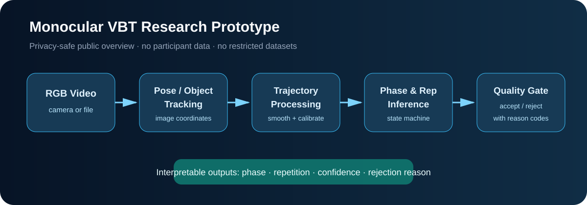
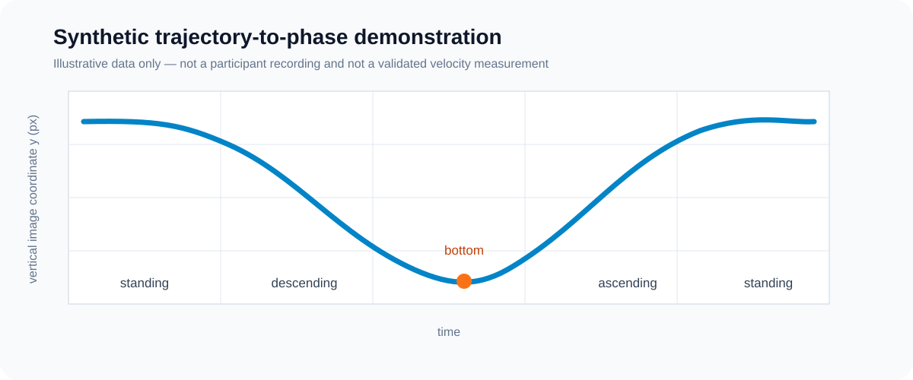

# Monocular VBT and Fitness-AQA Research Showcase

This public repository presents a privacy-safe overview of my undergraduate project on monocular vision-based velocity-based training (VBT) and the research direction that grew from it.

The original project explored whether a single consumer camera could support squat repetition detection, movement-phase analysis, trajectory processing, and quality-aware feedback. The current research direction extends this experience toward **few-label temporal error localization for fitness action quality assessment (AQA)**.

> This is a research and educational prototype. It is not a validated VBT instrument, medical device, or training-prescription system.

## Research progression

```text
Undergraduate prototype
Monocular video -> pose/trajectory -> repetitions and phase-aware metrics

Current research question
Trajectory-derived phase teacher + few temporal error labels
                         -> RGB-only temporal error localization
```

The main question for the next stage is:

> Can trajectory-derived action-phase supervision improve few-label temporal error localization in real-world fitness videos, while keeping the deployed model RGB-only?

Trajectory is therefore treated as **training-time supervision**, rather than simply being concatenated with RGB as an additional test-time input.

## System overview



The undergraduate prototype followed this core processing chain:

1. Read a video or camera frame.
2. Estimate body or equipment locations in image coordinates;
3. smooth the vertical trajectory and identify movement phases;
4. segment repetitions with a state machine;
5. reject low-confidence or low-range-of-motion observations;
6. report interpretable per-repetition summaries.

## Synthetic demonstration



The figure is generated from an illustrative synthetic trajectory. It contains no participant video or restricted dataset content.

## Public code

The small module in [`src/phase_teacher.py`](src/phase_teacher.py) demonstrates two ideas used in the research pipeline:

- converting a vertical image trajectory into coarse action phases;
- applying a quality gate before accepting a sequence for downstream analysis.

The code intentionally uses only the Python standard library so that the core logic remains easy to inspect.

```bash
python3 examples/run_demo.py
python3 -m unittest discover -s tests -v
```

Example output:

```text
quality.accepted=True
quality.valid_ratio=1.00
quality.rom_px=92.00
phases=standing,descending,descending,descending,bottom,ascending,ascending,ascending
```

## Repository boundaries

This public showcase deliberately excludes:

- participant or personal exercise videos and images;
- local databases and training CSV files;
- model weights and access credentials;
- private configuration and deployment details;
- Fitness-AQA, MyoMechanix, or any other restricted dataset files;
- claims of criterion validity against LPT, force plates, or motion capture.

The original engineering repository remains private. The code here is a small, independently organized teaching and research demonstration rather than a full copy of that system.

## Limitations

Monocular pixel trajectories are affected by camera angle, distance, perspective, occlusion, pose-estimation noise, and frame timing. Consequently, a visually derived velocity estimate must not be treated as a validated physical measurement without synchronized comparison against an appropriate reference instrument.

The current research emphasis is therefore moving from unvalidated velocity claims toward structured, phase-aware video understanding and temporal error localization.

## Author

**Ren Yuqi**  
The Hong Kong Polytechnic University  
GitHub: [renyuqihahaha](https://github.com/renyuqihahaha)
